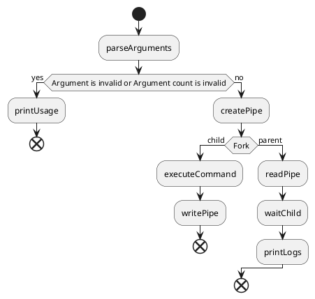
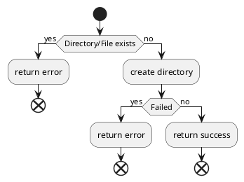
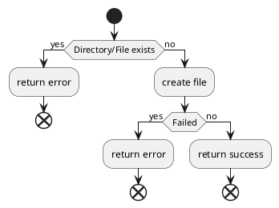
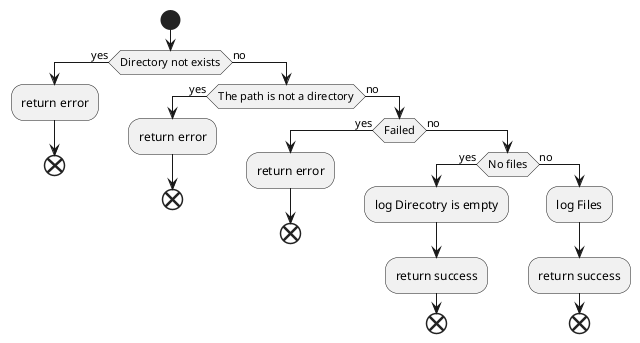
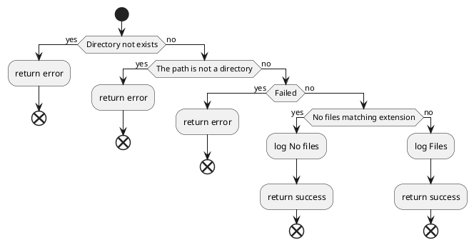
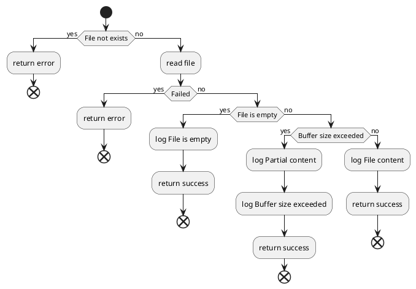
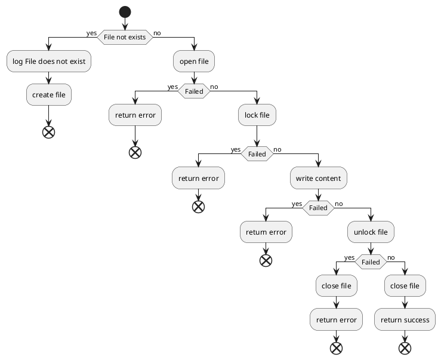
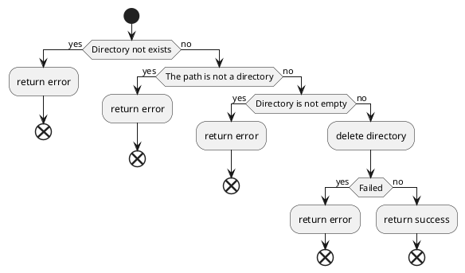
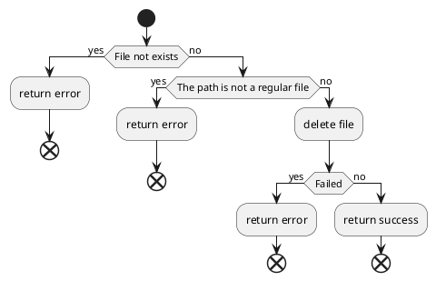
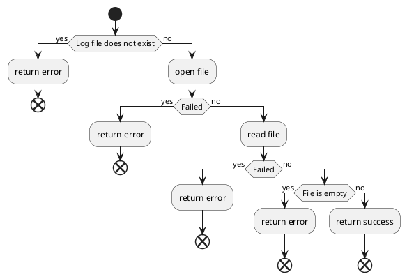

# CSE 344

## SYSTEM PROGRAMMING

Homework 1
Emirhan Altunel
200104004035

## Introduction

This homework is about running list of filesytem functions in `C` language. The content of this homework is as follows:

- [CSE 344](#cse-344)
  - [SYSTEM PROGRAMMING](#system-programming)
  - [Introduction](#introduction)
  - [Code Explanation](#code-explanation)
    - [Create Directory](#create-directory)
    - [Create File](#create-file)
    - [List Directory](#list-directory)
    - [List Files By Extension](#list-files-by-extension)
    - [Read File](#read-file)
    - [Append To File](#append-to-file)
    - [Delete Directory](#delete-directory)
    - [Delete File](#delete-file)
    - [Show Logs](#show-logs)
  - [Conclusion](#conclusion)

## Code Explanation

The code flow is as follows:



### Create Directory

#### Code Output

##### Wrong Argument Count

```text
demir@altu:~/Documents/Projects/CSE344-HW1$ ./main.out createDir
Error: Invalid number of arguments
demir@altu:~/Documents/Projects/CSE344-HW1$ ./main.out createDir test test
Error: Invalid number of arguments
```

##### Directory Creation

```text
demir@altu:~/Documents/Projects/CSE344-HW1$ ./main.out createDir test
Directory "test" created successfully
```

##### Directory Already Exists

```text
demir@altu:~/Documents/Projects/CSE344-HW1$ ./main.out createDir test
Directory "test" already exists
```

#### Code Flow



#### Code

```c
result_t createDir(const char *args[]) {
  const char *dirName = args[0];
  struct stat st;
  result_t res;

  if (stat(dirName, &st) == 0) {
    res.status = 1;
    strncpy(res.message, "Directory \"", BUFFER_SIZE);
    strcat(res.message, dirName);
    strcat(res.message, "\" already exists\n");
    return res;
  }

  if (mkdir(dirName, 0777) == -1) {
    res.status = 1;
    strncpy(res.message, "Failed to create \"", BUFFER_SIZE);
    strcat(res.message, dirName);
    strcat(res.message, "\" directory\n");
    return res;
  }

  res.status = 0;
  strncpy(res.message, "Directory \"", BUFFER_SIZE);
  strcat(res.message, dirName);
  strcat(res.message, "\" created successfully\n");
  return res;
}
```

### Create File

#### Code Output

##### Wrong Argument Count

```text
demir@altu:~/Documents/Projects/CSE344-HW1$ ./main.out createFile
Error: Invalid number of arguments
demir@altu:~/Documents/Projects/CSE344-HW1$ ./main.out createFile test test
Error: Invalid number of arguments
```

##### File Creation

```text
demir@altu:~/Documents/Projects/CSE344-HW1$ ./main.out createFile test.txt
File "test.txt" created successfully
```

##### File Already Exists

```text
demir@altu:~/Documents/Projects/CSE344-HW1$ ./main.out createFile test.txt
File "test.txt" already exists
```

#### Code Flow



#### Code

```c
result_t createFile(const char *args[]) {
  const char *fileName = args[0];
  struct stat st;
  result_t res;

  if (stat(fileName, &st) == 0) {
    res.status = 1;
    strncpy(res.message, "File \"", BUFFER_SIZE);
    strcat(res.message, fileName);
    strcat(res.message, "\" already exists\n");
    return res;
  }

  int fd = open(fileName, O_CREAT | O_WRONLY, 0777);
  if (fd == -1) {
    res.status = 1;
    strncpy(res.message, "Failed to create \"", BUFFER_SIZE);
    strcat(res.message, fileName);
    strcat(res.message, "\" file\n");
    return res;
  }
  close(fd);
  res.status = 0;
  strncpy(res.message, "File \"", BUFFER_SIZE);
  strcat(res.message, fileName);
  strcat(res.message, "\" created successfully\n");
  return res;
}
```

### List Directory

#### Code Output

##### Wrong Argument Count

```text
demir@altu:~/Documents/Projects/CSE344-HW1$ ./main.out listDir
Error: Invalid number of arguments
demir@altu:~/Documents/Projects/CSE344-HW1$ ./main.out listDir test test
Error: Invalid number of arguments
```

##### Directory Not Exists

```text
demir@altu:~/Documents/Projects/CSE344-HW1$ ./main.out listDir test
Directory "test" does not exist
```

##### Not A Directory

```text
demir@altu:~/Documents/Projects/CSE344-HW1$ ./main.out listDir Makefile
"Makefile" is not a directory
```

##### Directory Is Empty

```text
demir@altu:~/Documents/Projects/CSE344-HW1$ ./main.out listDir test
Directory "test" is empty
```

##### Files In Directory

```text
demir@altu:~/Documents/Projects/CSE344-HW1$ ./main.out listDir src
Files in directory "src":
-> functions.c
-> utils.c
-> main.c
```

#### Code Flow



#### Code

```c
result_t listDir(const char *args[]) {
  const char *dirName = args[0];
  struct stat st;
  result_t res;

  if (stat(dirName, &st) == -1) {
    res.status = 1;
    strncpy(res.message, "Directory \"", BUFFER_SIZE);
    strcat(res.message, dirName);
    strcat(res.message, "\" does not exist\n");
    return res;
  }

  if (!S_ISDIR(st.st_mode)) {
    res.status = 1;
    strncpy(res.message, "\"", BUFFER_SIZE);
    strcat(res.message, dirName);
    strcat(res.message, "\" is not a directory\n");
    return res;
  }

  struct dirent *entry;
  DIR *dp = opendir(dirName);
  if (dp == NULL) {
    res.status = 1;
    strncpy(res.message, "Failed to open directory \"", BUFFER_SIZE);
    strcat(res.message, dirName);
    strcat(res.message, "\"\n");
    return res;
  }

  res.status = 0;

  int found = 0;
  while ((entry = readdir(dp))) {
    if (entry->d_name[0] == '.') {
      continue;
    }

    if (found == 0) {
      strncpy(res.message, "Files in directory \"", BUFFER_SIZE);
      strcat(res.message, dirName);
      strcat(res.message, "\":\n");
      found = 1;
    }

    strcat(res.message, "-> ");
    strcat(res.message, entry->d_name);
    strcat(res.message, "\n");
  }

  if (found == 0) {
    strncpy(res.message, "Directory \"", BUFFER_SIZE);
    strcat(res.message, dirName);
    strcat(res.message, "\" is empty\n");
  }

  closedir(dp);
  return res;
}
```

### List Files By Extension

#### Code Output

##### Wrong Argument Count

```text
demir@altu:~/Documents/Projects/CSE344-HW1$ ./main.out listFilesByExtension
Error: Invalid number of arguments
demir@altu:~/Documents/Projects/CSE344-HW1$ ./main.out listFilesByExtension test test test
Error: Invalid number of arguments
```

##### Directory Not Exists

```text
demir@altu:~/Documents/Projects/CSE344-HW1$ ./main.out listFilesByExtension test txt
Directory "test" does not exist
```

##### Not A Directory

```text
demir@altu:~/Documents/Projects/CSE344-HW1$ ./main.out listFilesByExtension Makefile txt
"Makefile" is not a directory
```

##### No Files Matching Extension

```text
demir@altu:~/Documents/Projects/CSE344-HW1$ ./main.out listFilesByExtension src .txt
No files with extension ".txt" found in directory "src"
```

##### Files In Directory

```text
demir@altu:~/Documents/Projects/CSE344-HW1$ ./main.out listFilesByExtension src .c
Files with extension ".c" in directory "src":
-> functions.c
-> utils.c
-> main.c
```

#### Code Flow



#### Code

```c
result_t listFilesByExtension(const char *args[]) {
  const char *dirName = args[0];
  const char *extension = args[1];
  struct stat st;
  result_t res;

  if (stat(dirName, &st) == -1) {
    res.status = 1;
    strncpy(res.message, "Directory \"", BUFFER_SIZE);
    strcat(res.message, dirName);
    strcat(res.message, "\" does not exist\n");
    return res;
  }

  if (!S_ISDIR(st.st_mode)) {
    res.status = 1;
    strncpy(res.message, "\"", BUFFER_SIZE);
    strcat(res.message, dirName);
    strcat(res.message, "\" is not a directory\n");
    return res;
  }

  struct dirent *entry;
  DIR *dp = opendir(dirName);

  if (dp == NULL) {
    res.status = 1;
    strncpy(res.message, "Failed to open directory \"", BUFFER_SIZE);
    strcat(res.message, dirName);
    strcat(res.message, "\"\n");
    return res;
  }

  res.status = 0;

  int found = 0;
  while ((entry = readdir(dp))) {
    if (entry->d_name[0] == '.') {
      continue;
    }

    if (strstr(entry->d_name, extension) == NULL) {
      continue;
    }

    if (found == 0) {
      strncpy(res.message, "Files with extension \"", BUFFER_SIZE);
      strcat(res.message, extension);
      strcat(res.message, "\" in directory \"");
      strcat(res.message, dirName);
      strcat(res.message, "\":\n");
      found = 1;
    }

    strcat(res.message, "-> ");
    strcat(res.message, entry->d_name);
    strcat(res.message, "\n");
  }

  if (found == 0) {
    strncpy(res.message, "No files with extension \"", BUFFER_SIZE);
    strcat(res.message, extension);
    strcat(res.message, "\" found in directory \"");
    strcat(res.message, dirName);
    strcat(res.message, "\"\n");
  }

  closedir(dp);
  return res;
}
```

### Read File

#### Code Output

##### Wrong Argument Count

```text
demir@altu:~/Documents/Projects/CSE344-HW1$ ./main.out readFile
Error: Invalid number of arguments
demir@altu:~/Documents/Projects/CSE344-HW1$ ./main.out readFile test test
Error: Invalid number of arguments
```

##### File Not Exists

```text
demir@altu:~/Documents/Projects/CSE344-HW1$ ./main.out readFile test.txt
File "test.txt" does not exist
```

##### Failed To Open File

```text
demir@altu:~/Documents/Projects/CSE344-HW1$ ./main.out readFile .git/
Failed to read ".git/" file
```

##### Successful Read

```text
demir@altu:~/Documents/Projects/CSE344-HW1$ ./main.out readFile .gitignore
Content of ".gitignore" file:
*.out
*.tar.gz
*.zip
*.o
*.txt
.pytest_cache
__pycache__
.venv
```

#### Code Flow



#### Code

```c
result_t readFile(const char *args[]) {
  const char *fileName = args[0];
  struct stat st;
  result_t res;

  if (stat(fileName, &st) == -1) {
    res.status = 1;
    strncpy(res.message, "File \"", BUFFER_SIZE);
    strcat(res.message, fileName);
    strcat(res.message, "\" does not exist\n");
    return res;
  }

  int fd = open(fileName, O_RDONLY);
  if (fd == -1) {
    res.status = 1;
    strncpy(res.message, "Failed to open \"", BUFFER_SIZE);
    strcat(res.message, fileName);
    strcat(res.message, "\" file\n");
    return res;
  }

  char buffer[BUFFER_SIZE / 2];
  ssize_t bytesRead = read(fd, buffer, BUFFER_SIZE / 2);
  if (bytesRead == -1) {
    res.status = 1;
    strncpy(res.message, "Failed to read \"", BUFFER_SIZE);
    strcat(res.message, fileName);
    strcat(res.message, "\" file\n");
    close(fd);
    return res;
  }
  buffer[bytesRead] = '\0';
  close(fd);

  res.status = 0;

  if (bytesRead == 0) {
    strncpy(res.message, "File \"", BUFFER_SIZE);
    strcat(res.message, fileName);
    strcat(res.message, "\" is empty\n");
    return res;
  }

  strncpy(res.message, "Content of \"", BUFFER_SIZE);
  strcat(res.message, fileName);
  strcat(res.message, "\" file:\n");
  strcat(res.message, buffer);
  if (bytesRead == BUFFER_SIZE / 2) {
    strcat(res.message,
           "...\nBuffer size exceeded, only part of the file is shown");
  }
  strcat(res.message, "\n");
  return res;
}
```

### Append To File

#### Code Output

##### Wrong Argument Count

```text
demir@altu:~/Documents/Projects/CSE344-HW1$ ./main.out appendToFile
Error: Invalid number of arguments
demir@altu:~/Documents/Projects/CSE344-HW1$ ./main.out appendToFile test test test
Error: Invalid number of arguments
```

##### File Not Exists

```text
demir@altu:~/Documents/Projects/CSE344-HW1$ ./main.out appendToFile test2 HelloWorl
File "test2" does not exist, creating...
Content appended to "test2" file
demir@altu:~/Documents/Projects/CSE344-HW1$ ./main.out readFile test2
Content of "test2" file:
HelloWorl
```

##### Failed To Open File

```text
demir@altu:~/Documents/Projects/CSE344-HW1$ ./main.out appendToFile .git Hello
Failed to open ".git" file
```

##### Failed To Lock File

```text
demir@altu:~/Documents/Projects/CSE344-HW1$ ./main.out appendToFile test.txt Hello
Failed to lock "test.txt" file, is it already locked? or read-only?
```

##### Successful Append

```text
demir@altu:~/Documents/Projects/CSE344-HW1$ ./main.out readFile test.txt
Content of "test.txt" file:
Hello
demir@altu:~/Documents/Projects/CSE344-HW1$ ./main.out appendToFile test.txt "Emirhan"
Content appended to "test.txt" file
demir@altu:~/Documents/Projects/CSE344-HW1$ ./main.out readFile test.txt
Content of "test.txt" file:
Hello Emirhan
```

#### Code Flow



#### Code

```c
result_t appendToFile(const char *args[]) {
  const char *fileName = args[0];
  const char *content = args[1];
  struct stat st;
  result_t res = {0, ""};

  if (stat(fileName, &st) == -1) {
    strncpy(res.message, "File \"", BUFFER_SIZE);
    strcat(res.message, fileName);
    strcat(res.message, "\" does not exist, creating...\n");
  }

  int fd = open(fileName, O_WRONLY | O_APPEND | O_CREAT, 0777);
  if (fd == -1) {
    res.status = 1;
    strncpy(res.message, "Failed to open \"", BUFFER_SIZE);
    strcat(res.message, fileName);
    strcat(res.message, "\" file\n");
    return res;
  }

  struct flock lock;
  lock.l_type = F_WRLCK;
  lock.l_whence = SEEK_SET;
  lock.l_start = 0;
  lock.l_len = 0;

  if (fcntl(fd, F_SETLK, &lock) == -1) {
    res.status = 1;
    strncpy(res.message, "Failed to lock \"", BUFFER_SIZE);
    strcat(res.message, fileName);
    strcat(res.message, "\" file, is it already locked? or read-only?\n");
    close(fd);
    return res;
  }

  if (write(fd, content, strlen(content)) == -1) {
    res.status = 1;
    strncpy(res.message, "Failed to write to \"", BUFFER_SIZE);
    strcat(res.message, fileName);
    strcat(res.message, "\" file\n");
    close(fd);
    return res;
  }

  lock.l_type = F_UNLCK;
  if (fcntl(fd, F_SETLK, &lock) == -1) {
    res.status = 1;
    strncpy(res.message, "Failed to unlock \"", BUFFER_SIZE);
    strcat(res.message, fileName);
    strcat(res.message, "\" file, good luck :D\n");
    close(fd);
    return res;
  }

  close(fd);
  res.status = 0;
  strcat(res.message, "Content appended to \"");
  strcat(res.message, fileName);
  strcat(res.message, "\" file\n");
  return res;
}
```

### Delete Directory

#### Code Output

##### Wrong Argument Count

```text
demir@altu:~/Documents/Projects/CSE344-HW1$ ./main.out deleteDir
Error: Invalid number of arguments
demir@altu:~/Documents/Projects/CSE344-HW1$ ./main.out deleteDir test test
Error: Invalid number of arguments
```

##### Directory Not Exists

```text
demir@altu:~/Documents/Projects/CSE344-HW1$ ./main.out deleteDir hello
Directory "hello" does not exist
```

##### Not A Directory

```text
demir@altu:~/Documents/Projects/CSE344-HW1$ ./main.out deleteDir test.txt
"test.txt" is not a directory
```

##### Directory Is Not Empty

```text
demir@altu:~/Documents/Projects/CSE344-HW1$ ./main.out deleteDir obj
Directory "obj" is not empty
```

##### Successful Deletion

```text
demir@altu:~/Documents/Projects/CSE344-HW1$ ./main.out deleteDir test
Directory "test" deleted successfully
```

#### Code Flow



#### Code

```c
result_t deleteDir(const char *args[]) {
  const char *dirName = args[0];
  struct stat st;
  result_t res;

  if (stat(dirName, &st) == -1) {
    res.status = 1;
    strncpy(res.message, "Directory \"", BUFFER_SIZE);
    strcat(res.message, dirName);
    strcat(res.message, "\" does not exist\n");
    return res;
  }

  if (!S_ISDIR(st.st_mode)) {
    res.status = 1;
    strncpy(res.message, "\"", BUFFER_SIZE);
    strcat(res.message, dirName);
    strcat(res.message, "\" is not a directory\n");
    return res;
  }

  if (rmdir(dirName) == -1) {
    if (errno == ENOTEMPTY) {
      res.status = 1;
      strncpy(res.message, "Directory \"", BUFFER_SIZE);
      strcat(res.message, dirName);
      strcat(res.message, "\" is not empty\n");
      return res;
    }

    res.status = 1;
    strncpy(res.message, "Failed to delete \"", BUFFER_SIZE);
    strcat(res.message, dirName);
    strcat(res.message, "\" directory\n");
    return res;
  }

  res.status = 0;
  strncpy(res.message, "Directory \"", BUFFER_SIZE);
  strcat(res.message, dirName);
  strcat(res.message, "\" deleted successfully\n");
  return res;
}
```

### Delete File

#### Code Output

##### Wrong Argument Count

```text
demir@altu:~/Documents/Projects/CSE344-HW1$ ./main.out deleteFile
Error: Invalid number of arguments
demir@altu:~/Documents/Projects/CSE344-HW1$ ./main.out deleteFile test test
Error: Invalid number of arguments
```

##### File Not Exists

```text
demir@altu:~/Documents/Projects/CSE344-HW1$ ./main.out deleteFile test.txt
File "test.txt" does not exist
```

##### Not A Regular File

```text
demir@altu:~/Documents/Projects/CSE344-HW1$ ./main.out deleteFile src
"src" is not a regular file
```

##### Successful Deletion

```text
demir@altu:~/Documents/Projects/CSE344-HW1$ ./main.out deleteFile test.txt
File "test.txt" deleted successfully
```

#### Code Flow



#### Code

```c
result_t deleteFile(const char *args[]) {
  const char *fileName = args[0];
  struct stat st;
  result_t res;

  if (stat(fileName, &st) == -1) {
    res.status = 1;
    strncpy(res.message, "File \"", BUFFER_SIZE);
    strcat(res.message, fileName);
    strcat(res.message, "\" does not exist\n");
    return res;
  }

  if (!S_ISREG(st.st_mode)) {
    res.status = 1;
    strncpy(res.message, "\"", BUFFER_SIZE);
    strcat(res.message, fileName);
    strcat(res.message, "\" is not a regular file\n");
    return res;
  }

  if (unlink(fileName) == -1) {
    res.status = 1;
    strncpy(res.message, "Failed to delete \"", BUFFER_SIZE);
    strcat(res.message, fileName);
    strcat(res.message, "\" file\n");
    return res;
  }

  res.status = 0;
  strncpy(res.message, "File \"", BUFFER_SIZE);
  strcat(res.message, fileName);
  strcat(res.message, "\" deleted successfully\n");
  return res;
}
```

### Show Logs

#### Code Output

##### Wrong Argument Count

```text
demir@altu:~/Documents/Projects/CSE344-HW1$ ./main.out showLogs test
Error: Invalid number of arguments
```

##### Log File Not Exists

```text
demir@altu:~/Documents/Projects/CSE344-HW1$ ./main.out showLogs
Log file does not exist
```

##### Successful Read

```text
demir@altu:~/Documents/Projects/CSE344-HW1$ ./main.out showLogs
Logs:
[23/03/2025 15:06:04] Log file does not exist
```

#### Code Flow



#### Code

```c
result_t showLogs(const char *args[]) {
  (void)args;
  result_t res = {0, ""};

  if (access("log.txt", F_OK) == -1) {
    res.status = 1;
    strncpy(res.message, "Log file does not exist\n", BUFFER_SIZE);
    return res;
  }

  int fd = open("log.txt", O_RDONLY);
  if (fd == -1) {
    res.status = 1;
    strncpy(res.message, "Failed to open logs file\n", BUFFER_SIZE);
    return res;
  }

  char buffer[BUFFER_SIZE / 2];
  ssize_t bytesRead = read(fd, buffer, BUFFER_SIZE / 2);
  if (bytesRead == -1) {
    res.status = 1;
    strncpy(res.message, "Failed to read logs file\n", BUFFER_SIZE);
    close(fd);
    return res;
  }
  buffer[bytesRead] = '\0';
  close(fd);

  if (bytesRead == 0) {
    res.status = 1;
    strncpy(res.message, "Logs file is empty\n", BUFFER_SIZE);
    return res;
  }

  res.status = 0;
  strncpy(res.message, "Logs:\n", BUFFER_SIZE);
  strcat(res.message, buffer);

  if (bytesRead == BUFFER_SIZE / 2) {
    strcat(res.message,
           "...\nBuffer size exceeded, only part of the logs is shown\n");
  }
  return res;
}
```

## Conclusion

The main challenge is handling errors, nearly every function could have failed and need to be handled. To handle to memory i use stack memory as much as i can.
